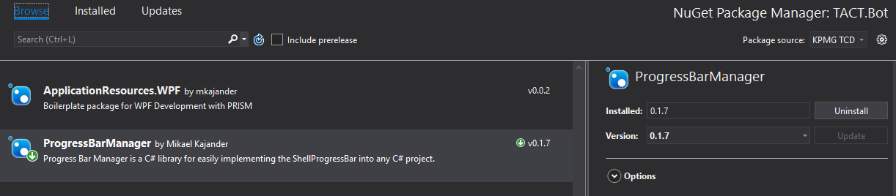

# Progress Bar Manager

Progress Bar Manager is a C# library for easily implementing the awesome [ShellProgressBar](https://github.com/Mpdreamz/shellprogressbar) into any C# project.

## Installation
Install the ProgressBarManager nuget package from KPMG TCD Package source.


This should install the prerequisites Prism.Core and ShellProgressBar.

## Usage

```C#
using ProgressBarManager;
using ProgressBarManager.Events;
using ProgressBarManager.Events.Payloads;
using Prism.Events;


public class ProcessMaster
    {
        IEventAggregator _ea;

        public ProcessMaster(IEventAggregator ea)
        {
            _ea = ea;
        }

        public async Task Start()
        {
            using (ShellProgressBarManager shellProgressBarManager = new ShellProgressBarManager(_ea))
            {
                //1. Spawning main progress bar 
                // SpawnProgressBarPayload accepts (string message, int totalTicks) which will always have the name "main"
                _ea.GetEvent<SpawnProgressBarEvent>().Publish(new SpawnProgressBarPayload("Initializing operations...", 3));

                // Initialize Stuff
                // Simulating initialization with a delay here
                await Task.Delay(1000);

                //2. Since ticking before the operation is done does not make sense using message to change the text instead.
                _ea.GetEvent<ProgressBarMessageEvent>().Publish(new TickPayload($"Doing first operation.", "main", true));
                await DoCalculations(10, "Task1");

                //3.1 Ticking and changing the main progress bar message
                _ea.GetEvent<TickBarEvent>().Publish(new TickPayload($"Doing second operation.", "main", true));
                await DoCalculations(20, "Task2");

                //3.2 Ticking and changing the main progress bar message
                _ea.GetEvent<TickBarEvent>().Publish(new TickPayload($"Doing third operation.", "main", true));
                await DoCalculations(10, "Task3");

                //3.3 Ticking for the last time and changing the main progress bar message
                _ea.GetEvent<TickBarEvent>().Publish(new TickPayload($"Done.", "main", true));
                await Task.Delay(2000);
            }
        }
        public async Task DoCalculations(int count, string taskName)
        {

            // 1. Spawning child progress bar with an unique name
            // SpawnChildProgressBarPayload accepts (string name, string message, int totalTicks) which will use the main as parent
            // or (string name, string message, int totalTicks, string parentName) which can have any child as parent based on the given name
            _ea.GetEvent<SpawnChildProgressBarEvent>().Publish(new SpawnChildProgressBarPayload(taskName, $"{taskName} starting", count));

            for (var i = 0; i < count; i++)
            {
                //Ignore randoms
                Random random = new Random();

                // constructing message for the operation. Not necessary.
                string Message = $"Start {i + 1} of {count}: {taskName}";

                //2. Since in this example we have a depth of 2 -> 2 children deep we spawn another progress bar but this bar is the child of the bar we spawned before at step 1 of this function.
                _ea.GetEvent<SpawnChildProgressBarEvent>().Publish(new SpawnChildProgressBarPayload($"{taskName}step{i}", $"{taskName} step {i} starting", 6, taskName));
                await Task.Delay(50);
                
                // Just a loop to generate childrens child events
                for (var j = 0; j < 6; j++)
                {

                    //Simulating doing something
                    await Task.Delay(random.Next(10, 50));


                    // Ticking the bar which was spawned in step 2 of this function.
                    _ea.GetEvent<TickBarEvent>().Publish(new TickPayload($"{taskName} step {i} part {j}/5", $"{taskName}step{i}"));
                }
                // Ticking the bar spawned in step 1 of this function.
                _ea.GetEvent<TickBarEvent>().Publish(new TickPayload(Message, taskName));

            }
        }
    }

```


## License
[MIT](https://choosealicense.com/licenses/mit/)
